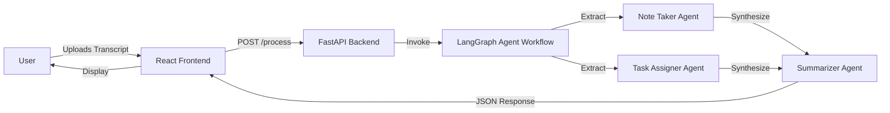

# MeetingAI - Project Overview

## Introduction

**MeetingAI** is an intelligent system designed to automate the post-meeting workflow. By analyzing raw meeting transcripts, it leverages generative AI agents to produce structured, actionable outputs. The system separates the concern of "taking notes" from "managing tasks" and "writing summaries," mimicking a real-world professional team.

This document provides a high-level view of the entire system, combining both the Frontend and Backend components.

## System Architecture

The project follows a decoupled **Client-Server architecture**, containerized with Docker for easy deployment and consistency.



### Components

1.  **Frontend (UI)**
    - **Role**: User Interface & Presentation Layer.
    - **Tech**: React, Vite.
    - **Responsibility**: Handles file uploads, displays loading states, and renders the complex JSON output (Markdown, Lists) into a human-readable format.

2.  **Backend (Core Logic)**
    - **Role**: API & Intelligence Layer.
    - **Tech**: FastAPI, LangGraph, OpenAI.
    - **Responsibility**: Orchestrates the AI agents. It does not just "summarize" a text; it runs a multi-step cognitive pipeline to separate facts from action items before writing the summary.

## Data Flow

1.  **Input**: A `.txt` file containing the dialogue of a meeting.
2.  **State Management**: The backend initializes a state object containing the transcript and empty placeholders for notes, tasks, and summary.
3.  **Agent Execution**:
    - The **Note Taker** reads the transcript and fills the `notes` bucket.
    - The **Task Assigner** reads the transcript and fills the `tasks` bucket.
    - The **Summarizer** reads *only* the `notes` and `tasks` buckets to write the `summary`.
4.  **Output**: The final state is returned to the Frontend to be visualized.

## Deployment & Operation

The entire system is orchestrated using `docker-compose`. This ensures that both the frontend and backend start simultaneously with the correct networking configuration.

### Quick Start

1.  **Configure Environment**:
    Ensure valid OpenAI API credentials are in the `.env` file.

2.  **Run System**:
    Execute the following command in the project root:
    ```bash
    docker-compose up --build
    ```

3.  **Access Application**:
    - **Frontend**: `http://localhost:3000` (or as configured)
    - **Backend API**: `http://localhost:8000`

## Documentation Links

For detailed technical specifications of each component, please refer to:

- [Frontend Documentation](./frontend_docs.md)
- [Backend Documentation](./backend_docs.md)
