# LangGraph Workflow - Mermaid Diagramok

## 1. Workflow Graph Topológia

```mermaid
graph TD
    A["🔍 validate_input<br/>(Input validálás)"] --> B["🎯 category_routing<br/>(Kategória LLM döntés)"]
    
    B --> C["🔢 embed_question<br/>(Vektor beágyazás)"]
    
    C --> D["📚 search_category<br/>(ChromaDB keresés)"]
    
    D --> E{{"🔎 evaluate_search<br/>(Minőség értékelés)"}}
    
    E -->|Jó eredmények| F["✓ fallback_search<br/>(Skip - már OK)"]
    E -->|Rossz/Nincs eredmény| F["🔄 fallback_search<br/>(Összes kategóriában)"]
    
    F --> G["🧹 dedup_chunks<br/>(Duplikálódás eltávolítás)"]
    
    G --> H["🤖 generate_answer<br/>(OpenAI LLM)"]
    
    H --> I["✨ format_response<br/>(Citációk formázása)"]
    
    I --> J["✅ END"]
    
    style A fill:#e1f5ff
    style B fill:#e1f5ff
    style C fill:#f0f4c3
    style D fill:#f0f4c3
    style E fill:#fff9c4
    style F fill:#fff9c4
    style G fill:#f0f4c3
    style H fill:#e1f5ff
    style I fill:#f0f4c3
    style J fill:#c8e6c9
```



## 2. State Flow - Adatok Áramlása


## 3. Search Strategy Decision Tree

```mermaid
graph TD
    A["Kategória keresés<br/>végrehajtása"] --> B{Eredmények<br/>száma?}
    
    B -->|>= 3 dokumentum| C{Átlagos<br/>relevancia?}
    B -->|< 3 dokumentum| D["⚠️ Fallback trigger"]
    B -->|0 dokumentum| D
    
    C -->|>= 0.3| E["✅ CATEGORY_BASED<br/>stratégia használata"]
    C -->|< 0.3| D
    
    D --> F["🔄 Keresés az összes<br/>kategóriában"]
    F --> G{Fallback<br/>eredmények?}
    
    G -->|Found| H["✅ FALLBACK_ALL_CATEGORIES<br/>stratégia használata"]
    G -->|Not Found| I["⚠️ No documents found<br/>Generic response"]
    
    E --> J["Deduplication<br/>Answer Generation"]
    H --> J
    I --> J
    
    style A fill:#fff9c4
    style E fill:#c8e6c9
    style H fill:#c8e6c9
    style I fill:#ffccbc
    style J fill:#f0f4c3
```



## 4. Activity Logging Timeline

```mermaid
graph LR
    subgraph T1["Phase 1: Input Validation"]
        A["🔍 Input validálva"]
    end
    
    subgraph T2["Phase 2: Routing & Embedding"]
        B["🎯 Kategória routing<br/>indítása"]
        C["✓ Kategória kiválasztva"]
        D["🔢 Kérdés beágyazása"]
        E["✓ Beágyazás elkészült"]
    end
    
    subgraph T3["Phase 3: Retrieval"]
        F["🔍 Keresés indítása"]
        G["✓ N dokumentum találva"]
        H{Fallback?}
        I["🔄 Fallback keresés"]
        J["✓ Fallback eredmények"]
    end
    
    subgraph T4["Phase 4: Generation"]
        K["🤖 Válasz generálása"]
        L["✓ Válasz elkészült"]
    end
    
    T1 --> T2 --> T3 --> T4
    T3 --> H
    H -->|Nem| K
    H -->|Igen| I --> J --> K
    
    style T1 fill:#e8f5e9
    style T2 fill:#e3f2fd
    style T3 fill:#fff9c4
    style T4 fill:#f3e5f5
```



## 5. Error Handling Flow

```mermaid
graph TD
    A["Workflow Start"] --> B{Input<br/>valid?}
    
    B -->|No| C["Error: Invalid Input"]
    C --> D["error_messages:<br/>Question is empty"]
    D --> END1["❌ Early Exit"]
    
    B -->|Yes| E["Category Routing"]
    E --> F{Category<br/>found?}
    
    F -->|No| G["Warning: No category"]
    G --> H["Fallback to all categories"]
    H --> I["⚠️ Continue workflow"]
    
    F -->|Yes| J["Vector Search"]
    J --> K{Results<br/>found?}
    
    K -->|No| L["Fallback Search"]
    L --> M{Fallback<br/>results?}
    
    M -->|Yes| N["✓ Continue with fallback"]
    M -->|No| O["⚠️ Generic response"]
    
    K -->|Yes| N
    O --> P["Answer Generation"]
    N --> P
    
    P --> Q["✅ Workflow Complete"]
    END1 --> Q
    
    style C fill:#ffccbc
    style D fill:#ffccbc
    style END1 fill:#e57373
    style Q fill:#c8e6c9
```



## 6. Node Dependencies & Interactions


## 7. API Call Mapping to Nodes


## 8. Workflow Execution Timeline (Example)

```mermaid
timeline
    title Workflow Execution Timeline
    section Input Phase
        T+0ms : validate_input : input_validated
    section Routing Phase
        T+50ms : category_routing : 🎯 Category routing started
        T+150ms : category_routing : ✓ Category selected: docs
    section Embedding Phase
        T+160ms : embed_question : 🔢 Question embedding
        T+250ms : embed_question : ✓ Embedding complete
    section Search Phase
        T+260ms : search_category : 🔍 Search in docs
        T+350ms : search_category : ✓ 5 documents found
        T+360ms : evaluate_search : Evaluating search quality
        T+370ms : fallback_search : ⚠️ Low relevance detected
        T+380ms : fallback_search : 🔄 Fallback search started
        T+450ms : fallback_search : ✓ Fallback complete
    section Processing Phase
        T+460ms : dedup_chunks : 🧹 Deduplication
        T+470ms : dedup_chunks : ✓ 8 unique chunks
    section Generation Phase
        T+480ms : generate_answer : 🤖 Generating answer
        T+750ms : generate_answer : ✓ Answer generated
    section Formatting Phase
        T+760ms : format_response : ✨ Formatting response
        T+770ms : format_response : ✅ Complete
```



## 9. State Transitions - DetailedView

```mermaid
stateDiagram-v2
    [*] --> INPUT: receive input
    
    INPUT --> VALIDATE: input received
    VALIDATE --> ROUTING: input validated
    ROUTING --> EMBED: category decided
    EMBED --> SEARCH: question embedded
    SEARCH --> EVAL: search completed
    EVAL --> FB{fallback needed?}
    
    FB -->|No| DEDUP: search was good
    FB -->|Yes| FBSEARCH: fallback triggered
    FBSEARCH --> DEDUP: fallback completed
    
    DEDUP --> GENERATE: chunks deduplicated
    GENERATE --> FORMAT: answer generated
    FORMAT --> [*]: response formatted
    
    note right of VALIDATE
        Checks:
        - Non-empty question
        - Available categories
    end note
    
    note right of ROUTING
        LLM-based decision
        Returns: category + confidence
    end note
    
    note right of EVAL
        Quality metrics:
        - Chunk count
        - Avg similarity
    end note
    
    note right of FB
        Fallback trigger:
        - No results OR
        - Avg similarity < 0.3
    end note
```

## 10. Async/Sync Wrapper Pattern


Ezek a diagramok segítik a LangGraph workflow vizualizálását és megértését!
