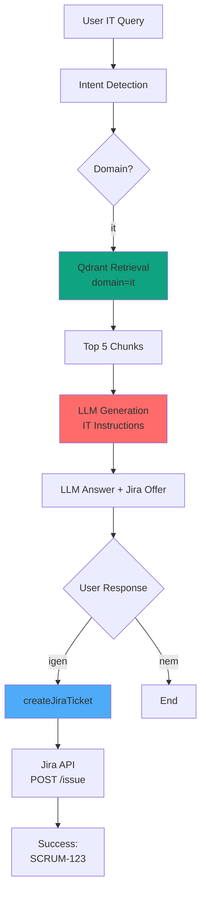

# IT Domain - Qdrant Semantic Search & Jira Integration

## Áttekintés

Az IT domain **Qdrant vektoradatbázist** használ semantic search-re és **Jira ticket létrehozást** kínál fel a felhasználóknak.

## Architektúra (v2 - Qdrant-based)

### Komponensek

1. **sync_confluence_it_policy.py** (`scripts/`)
   - **Indexelési idő**: Confluence IT Policy → Qdrant
   - Letölti a Confluence IT Policy page-t
   - Chunkolja (800 chars, 150 overlap)
   - Embedding generálás (OpenAI)
   - Qdrant indexelés (domain=`it`)

2. **QdrantRAGClient** (`infrastructure/qdrant_rag_client.py`)
   - **Runtime**: Semantic search Qdrant-ban
   - Domain filtering: `domain="it"`
   - Redis caching (embedding + query results)
   - Fallback mock: "Nincs releváns IT policy adat"

3. **QueryAgent Workflow** (`services/agent.py`)
   - IT domain detektálása
   - Qdrant retrieval (NEM közvetlen Confluence hívás)
   - LLM generation IT-specific instructions-el
   - Jira ticket offer a válasz végén

4. **AtlassianClient** (`infrastructure/atlassian_client.py`)
   - **Indexelési idő**: Confluence API (get_it_policy_content)
   - **Runtime**: Jira ticket creation
   - Singleton pattern

5. **CreateJiraTicketAPIView** (`api/views.py`)
   - POST `/api/jira/ticket/` endpoint
   - Fogadja: summary, description, issue_type, priority
   - Válasz: ticket key és URL

6. **Frontend** (`frontend/static/app.js`)
   - `lastITContext`: Tárolja az előző IT választ
   - "igen" válasz detektálása → `createJiraTicket()` hívás
   - **Nincs gomb**, csak chat-based flow

## Confluence IT Policy Indexelés

### Szkript: sync_confluence_it_policy.py

**Futtatás:**
```bash
# Docker container-ben
docker-compose exec backend python scripts/sync_confluence_it_policy.py --clear

# Lokálisan
python backend/scripts/sync_confluence_it_policy.py --clear
```

**Lépések:**
1. Confluence IT Policy lekérése (AtlassianClient.get_it_policy_content)
2. Sections chunkolása (RecursiveCharacterTextSplitter)
3. Embedding generálás (OpenAI text-embedding-3-small)
4. Qdrant upsert (collection: `multi_domain_kb`, domain: `it`)

**Environment változók:**
```bash
ATLASSIAN_BASE_URL=https://benketibor.atlassian.net
ATLASSIAN_EMAIL=your-email@example.com
CONFLUENCE_API_TOKEN=ATSTT3xFfGF0AVyYzwaGyU1o...
QDRANT_URL=http://qdrant:6333
QDRANT_COLLECTION=multi_domain_kb
```

### Confluence Oldal

- **URL**: https://benketibor.atlassian.net/wiki/spaces/SD/pages/6324226
- **Page ID**: `6324226`
- **API Token**: `ATSTT3xFfGF0AVyYzwaGyU1oTc6hNwZ6hGCkjyNE_QtxrDsP...` (környezeti változó)

### API Call

- **URL**: https://benketibor.atlassian.net/wiki/spaces/SD/pages/6324226
- **Page ID**: `6324226`

**API Call (indexelési idő):**
```bash
GET https://benketibor.atlassian.net/wiki/api/v2/pages/6324226?body-format=storage
Authorization: Bearer <CONFLUENCE_TOKEN>
Accept: application/json
```

**Parsing (`_parse_it_policy_sections`):**
1. HTML storage format → BeautifulSoup
2. Fejezetek (h1, h2, h3) felismerése
3. Tartalom kinyerése a következő fejlézig
4. Dict visszaadása: `{section_title: content}`

**Chunking:**
- RecursiveCharacterTextSplitter
- chunk_size: 800 chars
- chunk_overlap: 150 chars
- Metadata: section_id, section_title, confluence_url

## Runtime Workflow

### 1. User IT Kérdés

**Példa**: "VPN problémám van, mi a teendő?"

### 2. Intent Detection

Domain: `it`

### 3. Qdrant Retrieval

**Semantic Search:**
- Query embedding generálás (OpenAI)
- Qdrant search (domain filter: `it`)
- Top 5 relevant chunks
- Redis cache (embedding + query results)

**Fallback** (ha nincs Qdrant adat):
```python
Citation(
    doc_id="IT-NO-DATA",
    title="IT Policy Not Indexed",
    score=0.0,
    content="Nincs releváns IT policy adat..."
)
```

### RAG Optimalizációk (v2.4)

#### 1. Content Deduplication

**Probléma**: Ugyanaz az IT Policy tartalom PDF/DOCX/különböző formátumokban indexelve → duplikált chunks a válaszban.

**Megoldás**: `_deduplicate_citations()` funkció
- **Signature-based**: Title + content preview (első 80 karakter)
- **Highest score wins**: Legmagasabb semantic score-ú verzió megmarad
- **Pre-ranking**: Deduplikáció ELŐTT történik a feedback ranking-hoz

**Példa**:
```python
# Előtte: 5 citation (3 duplicate)
Citation("doc.pdf#0", score=0.95, content="VPN troubleshooting...")
Citation("doc.docx#0", score=0.92, content="VPN troubleshooting...")  # Duplicate
Citation("doc.pdf#1", score=0.88, content="Network setup...")

# Utána: 2 unique citation
Citation("doc.pdf#0", score=0.95, content="VPN troubleshooting...")
Citation("doc.pdf#1", score=0.88, content="Network setup...")
```

#### 2. IT Overlap Boost (Lexical Reranking)

**Cél**: IT domain-specifikus lexikai token matching a semantic search kiegészítésére.

**Működés**: `_apply_it_overlap_boost(citations, query)`
- Query tokenizálás (min 3 karakter)
- Token matching title + content-ben (case-insensitive)
- Score boost: 0-20% az overlap ratio alapján
- Magyar karakterek támogatása (áéíóöőúüű)

**Formula**:
```python
overlap_ratio = matched_tokens / total_query_tokens
boost_factor = 1 + min(0.2, overlap_ratio * 0.4)  # max 20%
final_score = semantic_score * boost_factor
```

**Példa**:
```python
Query: "VPN nem működik"
Tokens: ["VPN", "nem", "működik"]  # "nem" < 3 chars → ignored

Citation 1: "[IT-KB-234] VPN kliens lefagyott"
  - Matched: "VPN" (1/2 = 50%)
  - Boost: 1 + min(0.2, 0.5 * 0.4) = 1.2 (20%)
  - Score: 0.85 * 1.2 = 1.02

Citation 2: "[IT-KB-320] IT eszközpark lista"
  - Matched: none (0/2 = 0%)
  - Boost: 1.0
  - Score: 0.90 * 1.0 = 0.90

# Reranking: Citation 1 (1.02) > Citation 2 (0.90)
```

#### 3. Feedback-Weighted Ranking

**User feedback** (👍👎) használata a citation scoring-hoz.

**Tiered Boost System**:
- **>70% like**: +30% boost (high quality)
- **40-70% like**: +10% boost (moderate)
- **<40% like**: -20% penalty (poor quality)
- **No feedback**: 0% (neutral)

**Formula**:
```python
final_score = semantic_score * (1 + feedback_boost)
```

**Batch Optimization**: Egyetlen PostgreSQL query az összes citation feedback-hez (N+1 query elkerülése).

**Példa**:
```python
Citation A: semantic=0.85, feedback=85% → 0.85 * 1.3 = 1.105
Citation B: semantic=0.90, feedback=25% → 0.90 * 0.8 = 0.72

# A citation B-t megelőzi a feedback boost miatt
```

#### 4. Section ID Citations

**Probléma**: Generic "Document 1, Document 2" formátum helyett IT-specifikus section hivatkozások kellenek.

**Megoldás**: `section_id` field Citation model-ben + parser inheritance.

**Parser Logic** (`atlassian_client._parse_it_policy_sections`):
```python
last_section_id = None
for heading in headings:
    # Extract from title: "1. VPN [IT-KB-234]"
    section_id = extract_section_id(heading.text)
    
    # Inherit for subheadings without explicit ID
    if not section_id:
        section_id = last_section_id
    else:
        last_section_id = section_id
    
    # Prefix content with section_id
    content = f"[{section_id}] {content}"
```

**Chunking Logic** (`sync_confluence_it_policy.chunk_sections`):
```python
current_section_id = None
for section_title, content in sections.items():
    section_id = extract_or_inherit_section_id(section_title, content, current_section_id)
    
    # Ensure content has section_id prefix
    if section_id and not content.startswith(f"[{section_id}]"):
        content = f"[{section_id}] {content}"
    
    chunks = text_splitter.split(content)
    for chunk in chunks:
        chunk_metadata["section_id"] = section_id
```

**LLM Prompt**:
```
[IT-KB-234]
VPN kliens nem fut vagy lefagyott
VPN szolgáltatás megszakadt

[IT-KB-320]
IT eszközpark lista: FortiGate, FortiClient, ESET Endpoint
```

**LLM Response**:
```
A VPN hibaelhárítás [IT-KB-234] szerint:
1. Ellenőrizd a VPN klienst
2. Próbáld újraindítani
...

Forrás: [IT-KB-234] – IT Üzemeltetési és Felhasználói Szabályzat
```

### 4. Workflow Node

**IT domain esetén:**
```python
state["workflow"] = {
    "action": "it_support_ready",
    "type": "it_support",
    "next_step": "Offer Jira ticket creation",
    "jira_available": True
}
```

**NEM történik:**
- ❌ Közvetlen Confluence API hívás
- ❌ Keyword matching
- ❌ Section extraction runtime-ban

### 5. LLM Generation

**IT-specific prompt instructions:**
```
1. Provide clear, step-by-step troubleshooting
2. Reference section IDs when available (e.g., [IT-KB-234])
3. Include procedures and responsible parties
4. At the end, ALWAYS ask:

"📋 Szeretnéd, hogy létrehozzak egy Jira support ticketet ehhez a kérdéshez? 
(Válaszolj 'igen'-nel vagy 'nem'-mel)"
```

### 6. LLM Válasz Példa

```
A VPN problémák esetén az alábbi lépéseket kell követni [IT-KB-234]:

**Eljárásrend:**
1. Ellenőrizd, hogy a VPN kliens fut-e
2. Próbáld meg újraindítani a klienst
3. Ha továbbra is fennáll, fordulj az IT helpdesk-hez

**Felelősök:**
- IT Support Team: it-support@example.com

📋 Szeretnéd, hogy létrehozzak egy Jira support ticketet ehhez a kérdéshez?
(Válaszolj 'igen'-nel vagy 'nem'-mel)
```

### 7. Frontend: "igen" Válasz Detektálása

**`lastITContext` változó:**
```javascript
if (payload.domain === 'it' && payload.answer.includes('Jira support ticket')) {
    lastITContext = {
        query: query,
        answer: payload.answer
    };
}
```

**User "igen" válasza:**
```javascript
const isJiraConfirmation = lastITContext && 
    (query.toLowerCase() === 'igen' || 
     query.toLowerCase() === 'yes' ||
     query.toLowerCase().includes('igen'));

if (isJiraConfirmation) {
    await createJiraTicket(lastITContext.query, lastITContext.answer);
    lastITContext = null;
}
```

### 8. Jira Ticket Létrehozás

## Jira Ticket API

### Project Info

- **Project Key**: `SCRUM`
- **Board URL**: https://benketibor.atlassian.net/jira/software/projects/SCRUM/boards/1

### API Call

```bash
POST https://benketibor.atlassian.net/rest/api/3/issue
Authorization: Bearer <JIRA_TOKEN>
Content-Type: application/json

{
  "fields": {
    "project": { "key": "SCRUM" },
    "summary": "IT Support: VPN problémám van",
    "description": {
      "type": "doc",
      "version": 1,
      "content": [
        {
          "type": "paragraph",
          "content": [{ "type": "text", "text": "Kérdés: VPN problémám van\n\nBOT válasz: ..." }]
        }
      ]
    },
    "issuetype": { "name": "Task" },
    "priority": { "name": "Medium" }
  }
}
```

### Response

```json
{
  "key": "SCRUM-123",
  "self": "https://benketibor.atlassian.net/rest/api/3/issue/12345"
}
```

**Frontend megjelenítés:**
```
✅ Jira ticket sikeresen létrehozva: SCRUM-123
```

## Architektúra Összehasonlítás

### v1 (Régi - Közvetlen Confluence)

```
User IT Query
   ↓
Intent Detection (domain="it")
   ↓
Workflow Node:
   - atlassian_client.get_it_policy_content() ❌ Runtime API call
   - find_relevant_section() ❌ Keyword matching
   - Add citation to state
   ↓
LLM Generation (IT instructions)
   ↓
Frontend: UI buttons
   ↓
Jira Ticket Creation
```

### v2 (Új - Qdrant Semantic Search)

```
[INDEXING TIME - Egyszeri]
Confluence IT Policy
   ↓
sync_confluence_it_policy.py
   ↓
Chunking + Embedding
   ↓
Qdrant (domain="it")

[RUNTIME - Minden query]
User IT Query
   ↓
Intent Detection (domain="it")
   ↓
Qdrant Retrieval:
   - Semantic search ✅
   - Redis cache ✅
   - Domain filtering ✅
   ↓
LLM Generation (IT instructions + Jira offer)
   ↓
Frontend: "igen" válasz detektálása
   ↓
Jira Ticket Creation
```

## Előnyök (v2.4)

1. **Semantic Search**: Keyword matching helyett valódi szemantikus keresés
2. **Caching**: Redis cache (embedding + query results)
3. **Scalability**: Több Confluence page is indexelhető
4. **Consistency**: Ugyanaz a workflow mint más domainek (HR, Marketing)
5. **Performance**: Nincs runtime Confluence API hívás
6. **Chat-based Flow**: Természetesebb UX ("igen" válasz vs. gomb)
7. **Content Deduplication** (v2.4): PDF/DOCX duplikátumok automatikus eltávolítása
8. **Feedback Ranking** (v2.4): User feedback alapú adaptive learning (+30%/-20% boost)
9. **IT Overlap Boost** (v2.4): Lexikai token matching (0-20% boost VPN, network stb. query-khez)
10. **Section ID Citations** (v2.3): Authentic IT-KB-XXX hivatkozások "Document 1" helyett

## Workflow Diagram



## Konfiguráció

### Környezeti Változók (.env)

```bash
# Atlassian (Confluence + Jira)
ATLASSIAN_BASE_URL=https://benketibor.atlassian.net
ATLASSIAN_EMAIL=your-email@example.com
CONFLUENCE_API_TOKEN=ATSTT3xFfGF0AVyYzwaGyU1o...
JIRA_API_TOKEN=ATSTT3xFfGF0szHBOljaefnkv...

# Qdrant
QDRANT_URL=http://qdrant:6333
QDRANT_COLLECTION=multi_domain_kb

# OpenAI
OPENAI_API_KEY=sk-proj-...
EMBEDDING_MODEL=text-embedding-3-small

# Redis
REDIS_HOST=redis
REDIS_PORT=6379
```

### API Token Generálás

**1. Confluence Token:**
- https://id.atlassian.com/manage-profile/security/api-tokens
- "Create API token"
- Név: "KnowledgeRouter Confluence Read"
- Jogosultság: Read Confluence pages

**2. Jira Token:**
- https://id.atlassian.com/manage-profile/security/api-tokens
- "Create API token"
- Név: "KnowledgeRouter Jira Write"
- Jogosultság: Create issues in SCRUM project

## Setup Lépések

### 1. Token-ek beállítása

Másold az `.env.example` fájlt `.env`-be és állítsd be a token-eket:

```bash
cp .env.example .env
# Szerkeszd a .env fájlt a valódi token-ekkel
```

### 2. Backend Build

```bash
docker-compose build backend
docker-compose up -d backend
```

### 3. Confluence IT Policy Indexelése

```bash
docker-compose exec backend python scripts/sync_confluence_it_policy.py --clear
```

**Kimenet:**
```
✅ Initialized ConfluenceITPolicySync
🗑️ Clearing existing IT domain documents...
📥 Retrieving IT Policy from Confluence...
✅ Retrieved 15 sections from IT Policy
📄 Chunking 15 sections...
✅ Created 42 chunks from 15 sections
🧠 Generating embeddings for 42 chunks...
✅ Generated 42 embeddings (cache hits: 0/42)
💾 Upserting 42 chunks to Qdrant...
✅ Successfully upserted 42 chunks to Qdrant
✅ Confluence IT Policy sync completed successfully!
```

### 4. Qdrant Ellenőrzés

```bash
# Qdrant UI
http://localhost:6334/dashboard

# Collection info
curl http://localhost:6334/collections/multi_domain_kb

# IT domain docs száma
curl -X POST http://localhost:6334/collections/multi_domain_kb/points/scroll \
  -H "Content-Type: application/json" \
  -d '{"filter": {"must": [{"key": "domain", "match": {"value": "it"}}]}, "limit": 100}'
```

## Tesztelés

### Unit Tesztek

```bash
docker-compose exec backend python manage.py test tests.test_atlassian_client -v 2
```

**Megjegyzés**: Confluence tesztek csak indexeléskor relevánsak, Jira tesztek runtime.

### Manual Test: IT Query

**1. Kérdés:**
```
VPN problémám van, mi a teendő?
```

**Elvárás:**
- Domain: `it`
- Qdrant retrieval (semantic search, domain=`it`)
- LLM válasz IT Policy sections alapján
- Section ID referencia: `[IT-KB-234]`
- Jira ticket offer: "📋 Szeretnéd, hogy létrehozzak..."

**2. "igen" Válasz:**
```
igen
```

**Elvárás:**
- Frontend detektálja az "igen" választ
- `createJiraTicket()` hívás
- API POST `/api/jira/ticket/`
- Success message: "✅ Jira ticket sikeresen létrehozva: SCRUM-123"

### Debug: Qdrant Retrieval

**Backend log:**
```
INFO Retrieval node executing for domain=it
INFO Qdrant search: domain=it, query="VPN problémám van"
INFO Retrieved 5 chunks from Qdrant
INFO Top citation: IT-KB-234 (score: 0.92)
```

**Frontend debug panel:**
- Domain: `it`
- Chunk Count: `5`
- Max Score: `0.920`
- Citations: VPN Troubleshooting Guide

## Troubleshooting
2. Próbáld meg újraindítani a kli enst
3. Ha továbbra is fennáll, fordulj az IT helpdesk-hez

**Felelősök:**
- IT Support Team: it-support@example.com

📞 **Kapcsolattartás**: IT Helpdesk - Tel: +36 1 234 5678

📋 Szeretnéd, hogy létrehozzak egy Jira support ticketet ehhez a kérdéshez? 
Válaszolj 'igen'-nel, ha segítségre van szükséged.
```

### 7. Frontend: Jira Ticket Offer

`handleJiraTicketOffer()` detektálja az ajánlatot és hozzáad 2 gombot:

```html
<div class="jira-ticket-prompt">
  <p>📋 Szeretnéd, hogy létrehozzak egy Jira support ticketet?</p>
  <button onclick="createJiraTicket(...)">✅ Igen, hozz létre ticketet</button>
  <button onclick="this.parentElement.remove()">❌ Nem kell</button>
</div>
```

### Confluence API 401 Unauthorized

```
❌ HTTP error retrieving Confluence page: 401
```

**Megoldás:**
- Ellenőrizd `CONFLUENCE_API_TOKEN` environment variable
- Token érvényességének ellenőrzése: https://id.atlassian.com/manage-profile/security/api-tokens
- Email cím helyes-e: `ATLASSIAN_EMAIL`

### Jira API 400 Bad Request

```
❌ HTTP error creating Jira ticket: 400
```

**Megoldás:**
- Ellenőrizd `JIRA_API_TOKEN` environment variable
- Project key helyes-e: `SCRUM`
- Issue type létezik-e: `Task` (vagy `Bug`, `Story`)
- Priority helyes-e: `Medium` (vagy `High`, `Low`, `Highest`, `Lowest`)

### Qdrant Connection Refused

```
⚠️ Could not clear IT domain: [Errno 111] Connection refused
```

**Megoldás:**
- Qdrant container fut-e: `docker-compose ps`
- URL helyes-e: `QDRANT_URL=http://qdrant:6333` (Docker network)
- Port mapping: `6334:6333` (host:container)

### No IT Policy sections retrieved

```
❌ Sync failed: No sections retrieved
```

**Megoldás:**
- Confluence page ID helyes-e: `6324226`
- Page publikus vagy hozzáférhető a token-nal?
- HTML parsing hiba: ellenőrizd a `_parse_it_policy_sections()` logikát

### Frontend: Jira button not appearing

**Megoldás:**
- LLM válasz tartalmazza-e: "Jira support ticket" vagy "Jira ticketet"
- `lastITContext` beállítódik-e IT válasz esetén
- Browser console error-ok

### Qdrant-ban nincs IT adat

**Mock fallback válasz:**
```
Nincs releváns IT policy adat a kérdés megválaszolásához.
Kérlek, indexeld a Confluence IT Policy-t a sync_confluence_it_policy.py szkripttel.
```

**Megoldás:**
```bash
docker-compose exec backend python scripts/sync_confluence_it_policy.py --clear
```

## Következő Lépések

1. **✅ Confluence IT Policy indexelése**: Több page indexelése
2. **✅ Ticket template-ek**: Priority/issue type auto-detection
3. **✅ Jira workflow**: Ticket státusz tracking
4. **✅ Frontend UX**: Ticket link preview, status indicator
5. **✅ Többnyelvűség**: Angol IT policy support

## Összefoglalás

Az IT domain most:
- ✅ **Qdrant semantic search-t** használ (nem keyword matching)
- ✅ **Redis cache-eli** az embedding-eket és query results-okat
- ✅ **Jira ticket-et hoz létre** user "igen" válaszára
- ✅ **Chat-based flow** (természetesebb UX)
- ✅ **Scalable**: Több Confluence page is indexelhető
- ✅ **Consistent**: Ugyanaz a workflow mint más domainek

**Fontos**: Confluence API csak **indexelési időben** használódik, runtime-ban Qdrant semantic search fut.

## Összefoglalás

Az IT domain most:
- ✅ **Valós Confluence IT Policy-t** használ (nem mock)
- ✅ **Jira ticket-et hoz létre** user kérésre
- ✅ **LangGraph workflow vezérelten** működik
- ✅ **Singleton Atlassian client** clean architecture
- ✅ **Unit tesztek** lefedik az új funkciókat
- ✅ **Frontend UI** kezeli a ticket creation flow-t

**Fontos**: Az IT mock data (`IT-KB-234`, `IT-KB-189`) **törölve lett**, helyette Confluence API-t használunk.
