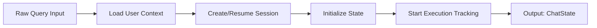
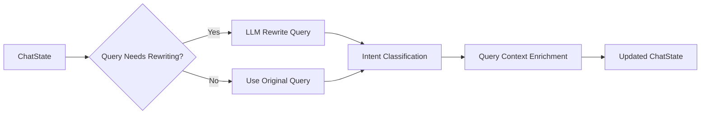
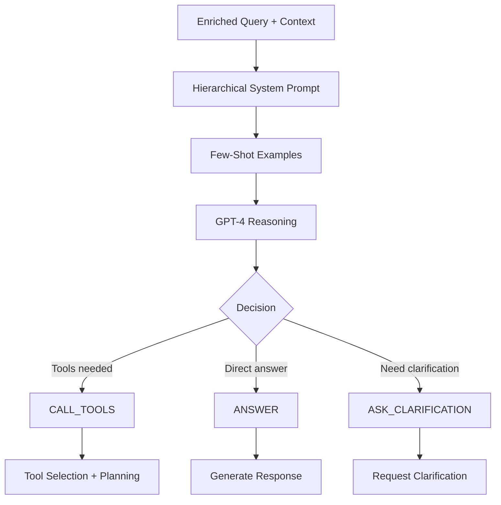
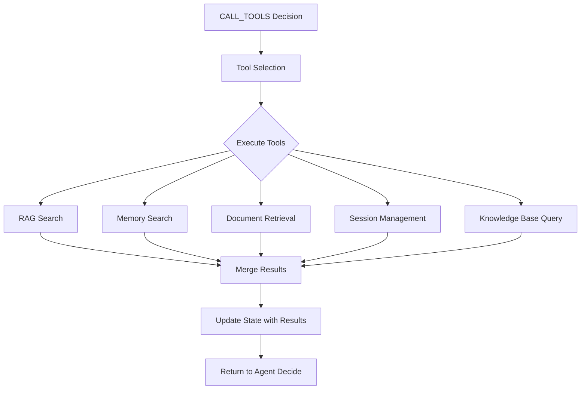
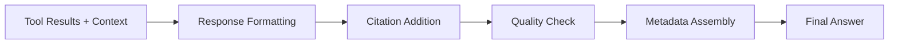

# Workflow Diagram - Knowledge Router

## Mit csinál (felhasználói nézőpont)

Ez a dokumentum tartalmazza a Knowledge Router LangGraph workflow rendszer teljes vizuális térképét. Minden user query egy strukturált workflow-n keresztül halad, ami biztosítja a konzisztens minőséget és auditálhatóságt.

## Használat

### Workflow állapot nyomon követése
```python
# Workflow execution követése
from services.unified_chat_workflow import UnifiedChatWorkflow
workflow = UnifiedChatWorkflow(tenant_id=1, user_id=1)
final_state = workflow.run({"query": "Mi a szabályzat a távmunkáról?"})
print(f"Workflow took: {final_state.total_execution_time_ms}ms")
```

### Manual workflow trigger (debug)
```python
# Teljes workflow manual futtatás
from services.chat_workflow_service import ChatWorkflowService
service = ChatWorkflowService()
result = service.process_chat_query("Hello", tenant_id=1, user_id=1, session_id=None)
```

## Technikai implementáció

### Main Workflow Architecture

```
┌─────────────────────────────────────────────────────────────────┐
│                    UNIFIED CHAT WORKFLOW                       │
│                  (LangGraph StateGraph)                        │
└─────────────────────────────────────────────────────────────────┘
                                  │
                                  ▼
┌─────────────────────────────────────────────────────────────────┐
│  START NODE: initialize                                         │
│  • Load user/tenant context                                     │
│  • Create session if needed                                     │
│  • Validate input query                                         │
│  • Start workflow execution tracking                            │
└─────────────────────────────────────────────────────────────────┘
                                  │
                                  ▼
┌─────────────────────────────────────────────────────────────────┐
│  NODE: prepare_query                                            │
│  • Query preprocessing                                          │
│  • Context augmentation with user preferences                   │
│  • Query rewriting if needed                                    │
│  • Intent classification (if implemented)                       │
└─────────────────────────────────────────────────────────────────┘
                                  │
                                  ▼
┌─────────────────────────────────────────────────────────────────┐
│  NODE: agent_decide                                             │
│  • GPT-4 reasoning with hierarchical system prompts            │
│  • Tool selection based on query analysis                      │
│  • Multi-step planning                                         │
│  • Decision: CALL_TOOLS / ANSWER / ASK_CLARIFICATION          │
└─────────────────────────────────────────────────────────────────┘
                                  │
                          ┌───────┼───────┐
                          ▼       ▼       ▼
                    CALL_TOOLS  ANSWER  ASK_CLARIFICATION
                          │       │       │
                          │       │       └─────────────────┐
                          │       │                         │
                          │       └──────────┐              │
                          │                  │              │
                          ▼                  ▼              ▼
┌─────────────────────────────┐  ┌──────────────────┐  ┌──────────────┐
│  NODE: tools                │  │  NODE: finalize  │  │  NODE: final │
│  • RAG search               │  │  • Format answer │  │  • End workflow│
│  • Document retrieval       │  │  • Add citations │  │  • Save state │
│  • Long-term memory search  │  │  • Log response  │  │  • Return     │
│  • Knowledge base queries   │  │                  │  │    result     │
│  • External API calls       │  │                  │  └──────────────┘
│  • Memory creation          │  │                  │
│  • Session management       │  │                  │
└─────────────────────────────┘  └──────────────────┘
                          │                  ▲
                          │                  │
                          └──────────────────┘
                            (Loop back to agent_decide)
```

### Detailed Node Execution Flow

#### 1. Initialize Node


**Responsibilities:**
- User/tenant context loading from database
- Session management (create new or resume existing)
- Input validation and sanitization
- Execution tracking initialization

**State modifications:**
```python
state.user_id = user_id
state.tenant_id = tenant_id
state.session_id = session_id or create_new_session()
state.original_query = query
state.user_context = load_user_context(user_id, tenant_id)
```

#### 2. Prepare Query Node


**Query rewriting examples:**
```
Original: "szabályzat távmunka"
Rewritten: "Mi a vállalati szabályzat a távmunkával kapcsolatban?"

Original: "projekt status?"  
Rewritten: "Mi a jelenlegi projekt státusza és mik a következő lépések?"
```

**Intent classification (future enhancement):**
- `document_search`: RAG-based knowledge retrieval
- `memory_retrieval`: Long-term memory query
- `general_chat`: Conversational response
- `task_request`: Action requiring tools
- `clarification_needed`: Ambiguous query

#### 3. Agent Decide Node (GPT-4 Reasoning)


**System prompt structure:**
```python
system_prompt = f"""
{tenant_system_prompt}  # Tenant-specific guidelines
{user_system_prompt}    # User preferences & context
{base_workflow_prompt}  # Core workflow instructions

User timezone: {user_timezone}
User language: {user_language}
Current session context: {session_context}
Available tools: {tool_list}

Respond with one of: CALL_TOOLS, ANSWER, ASK_CLARIFICATION
"""
```

**Decision criteria:**
- `CALL_TOOLS`: Query requires information not in conversation context
- `ANSWER`: Can respond directly from available context
- `ASK_CLARIFICATION`: Query is ambiguous or lacks necessary details

#### 4. Tools Node (Multi-Tool Execution)


**Available tools:**

**RAG Document Search:**
```python
def rag_search(query: str, tenant_id: int, top_k: int = 5) -> List[DocumentChunk]:
    # Semantic search in Qdrant
    # Filter by tenant_id for isolation
    # Return relevant chunks with citations
```

**Long-Term Memory Search:**
```python
def memory_search(query: str, user_id: int, memory_type: str = None) -> List[Memory]:
    # User-specific memory retrieval
    # Semantic similarity in vector space
    # Support filtering by memory_type
```

**Document Processing:**
```python
def document_upload(file_data: bytes, filename: str, tenant_id: int, user_id: int = None):
    # Process uploaded document
    # Create chunks and embeddings
    # Store in PostgreSQL + Qdrant
```

**Session Management:**
```python
def create_memory(content: str, user_id: int, memory_type: str = 'explicit_fact'):
    # Create user-specific long-term memory
    # Generate embedding and store in Qdrant
    # Add to PostgreSQL with metadata
```

#### 5. Finalize Node


**Response formatting:**
- Markdown support for rich text
- Proper citation format: `[1]`, `[2]`, etc.
- Source attribution with document titles
- Multi-language support (Hungarian/English)

**Citation format:**
```markdown
A vállalati távmunka szabályzat szerint hetente minimum 2 nap 
irodai jelenlét szükséges [1]. A rugalmas munkaidő 8:00-18:00 
között biztosított [2].

**Források:**
[1] HR Kézikönyv - Távmunka szabályzat (2024-01-15)
[2] Munkaidő és jelenléti szabályok (2023-12-10)
```

### State Management

#### ChatState Structure
```python
class ChatState(TypedDict, total=False):
    # Core query tracking
    query: str                    # Current query being processed
    original_query: str           # User's exact input
    rewritten_query: str          # LLM-optimized query
    query_intent: str             # Classified intent
    
    # User context
    user_id: int
    tenant_id: int
    session_id: str
    user_context: UserContext
    
    # Workflow execution
    workflow_path: str            # Current execution path
    agent_decision: str           # CALL_TOOLS, ANSWER, ASK_CLARIFICATION  
    tools_to_call: List[str]      # Planned tool executions
    iteration_count: int          # Loop iteration counter
    max_iterations: int           # Safety limit
    
    # Tool results
    rag_results: List[DocumentChunk]
    memory_results: List[Memory]
    tool_outputs: Dict[str, Any]
    
    # Response generation
    final_answer: str
    sources_cited: List[Source]
    confidence_score: float       # Response quality estimate
    
    # Execution tracking
    total_execution_time_ms: int
    node_execution_log: List[NodeExecution]
    error_message: str
    status: str                   # running, success, error
```

#### State Transitions
```python
# State progression through workflow
initialize: {} -> {user_id, tenant_id, session_id, query}
prepare_query: {query} -> {rewritten_query, query_intent}
agent_decide: {rewritten_query} -> {agent_decision, workflow_path}
tools: {agent_decision} -> {rag_results, tool_outputs}
finalize: {tool_outputs} -> {final_answer, sources_cited}
```

### Loop and Iteration Management

#### Agent Decision Loop
```python
# Maximum iteration safety
MAX_AGENT_ITERATIONS = 5

# Loop conditions
while state["iteration_count"] < MAX_AGENT_ITERATIONS:
    decision = agent_decide(state)
    if decision == "CALL_TOOLS":
        execute_tools(state)
        # Continue loop for re-evaluation
    elif decision in ["ANSWER", "ASK_CLARIFICATION"]:
        break  # Exit loop
    state["iteration_count"] += 1
```

**Loop prevention:**
- Hard iteration limit
- State change detection (prevent infinite loops)
- Tool execution timeout
- Resource consumption monitoring

#### Multi-step Tool Planning
```python
# Example complex query requiring multiple steps:
query = "A legújabb marketing prezentációból mennyi az IT költségvetés?"

# Step 1: Find marketing presentation
rag_search("marketing prezentáció legújabb", limit=3)

# Step 2: Extract budget information  
document_analysis("IT költségvetés marketing prezentáció")

# Step 3: Format numerical answer
format_budget_response(extracted_numbers)
```

### Performance Monitoring

#### Workflow Metrics
```python
# Tracked in workflow_executions table
execution_metrics = {
    'duration_ms': total_time,
    'node_count': len(executed_nodes),
    'iteration_count': agent_loops,
    'tools_called': tool_usage_log,
    'llm_tokens': total_tokens,
    'llm_cost_usd': estimated_cost
}
```

#### Node-level Tracking
```python
# Tracked in node_executions table  
node_metrics = {
    'node_name': 'agent_decide',
    'duration_ms': node_execution_time,
    'state_before': deep_copy(input_state),
    'state_after': deep_copy(output_state),
    'metadata': {
        'llm_model': 'gpt-4o-2024-11-20',
        'tokens_used': 150,
        'decision_made': 'CALL_TOOLS'
    }
}
```

### Error Handling

#### Node-level Errors
```python
try:
    result = execute_node(state)
except ToolExecutionError as e:
    state["error_message"] = str(e)
    state["status"] = "error"
    # Continue to finalize with error state
except LLMTimeoutError as e:
    # Retry with exponential backoff
    retry_with_backoff(execute_node, state)
```

#### Graceful Degradation
```python
# If RAG search fails, continue with memory search
if not rag_results:
    log_warning("RAG search failed, using memory fallback")
    memory_results = memory_search(query, user_id)
    
# If all tools fail, provide helpful error message
if not any_results:
    final_answer = "Sajnálom, jelenleg nem tudok segíteni. Kérj segítséget az adminisztrátortól."
```

### Testing & Debugging

#### Workflow Debugging
```python
# Debug specific workflow path
debug_workflow = UnifiedChatWorkflow(debug_mode=True)
debug_workflow.enable_step_by_step()
result = debug_workflow.run({"query": "test query"})

# Inspect node execution history
for node_execution in result["node_execution_log"]:
    print(f"Node: {node_execution['node_name']}")
    print(f"Duration: {node_execution['duration_ms']}ms")
    print(f"State changes: {node_execution['state_diff']}")
```

#### Tool Testing
```python
# Individual tool testing
from services.tools.rag_tool import RAGTool
rag = RAGTool()
results = rag.search("test query", tenant_id=1, user_id=1)
assert len(results) > 0
assert all(result.tenant_id == 1 for result in results)
```

## Funkció-specifikus konfiguráció

### Environment Configuration
```ini
# Workflow behavior settings
MAX_AGENT_ITERATIONS=5
TOOL_EXECUTION_TIMEOUT_SEC=30
LLM_TIMEOUT_SEC=15
ENABLE_QUERY_REWRITING=true
ENABLE_INTENT_CLASSIFICATION=false

# Performance settings
WORKFLOW_EXECUTION_TIMEOUT_SEC=120
MAX_RAG_RESULTS=10
MAX_MEMORY_RESULTS=5
ENABLE_REFLECTION=false
```

### Multi-tenant Workflow Isolation
```python
# Each workflow execution isolated by tenant
workflow_state = {
    'tenant_id': tenant_id,  # Must be consistent across all nodes
    'user_id': user_id,      # User context for personalization
}

# All tool calls enforce tenant isolation
rag_search(query, tenant_id=tenant_id)  # Only searches tenant documents
memory_search(query, user_id=user_id)   # Only user's personal memories
```

### Customization Points

#### Tenant-specific Workflow Behavior
```python
# Tenant system prompts can modify workflow behavior
tenant_prompt = """
For ACME Corporation:
- Always prioritize internal policy documents
- Include compliance warnings for financial queries  
- Respond in Hungarian for Hungarian users
- Cite sources using company format
"""
```

#### User-specific Preferences
```python
user_preferences = {
    'language': 'hu',
    'timezone': 'Europe/Budapest', 
    'response_length': 'detailed',
    'citation_style': 'academic'
}
```

### Future Enhancement Areas

#### Advanced Routing
```python
# Intent-based workflow routing (future)
if intent == "document_search":
    workflow_path = "rag_focused"
elif intent == "memory_retrieval": 
    workflow_path = "memory_focused"  
elif intent == "general_chat":
    workflow_path = "conversational"
```

#### Quality Assurance
```python
# Response quality evaluation (future)
quality_score = evaluate_response_quality(
    query=query,
    answer=final_answer,
    sources=sources_cited
)
if quality_score < 0.7:
    trigger_human_review(execution_id)
```

#### Multi-modal Support
```python
# Support for image/audio inputs (future)
if input_type == "image":
    ocr_text = extract_text_from_image(input_data)
    query = f"Analyze this image content: {ocr_text}"
```